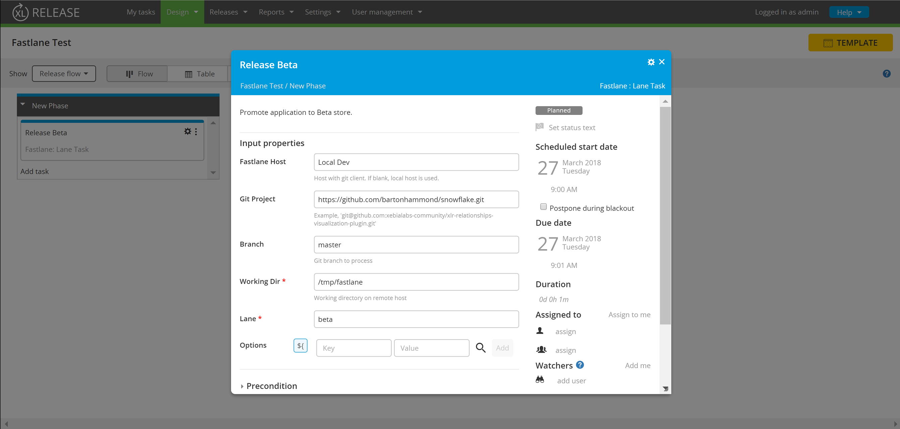
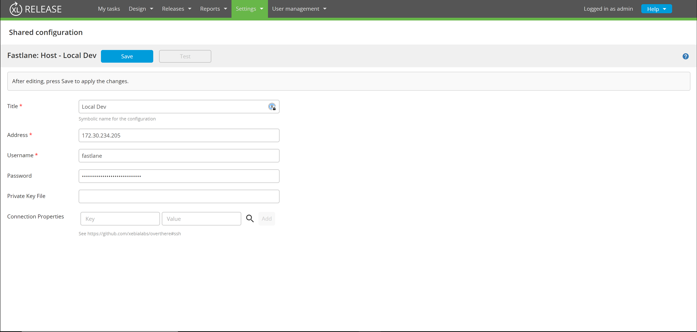

# XL Release Fastlane plugin v1.0.0

[![License: MIT][xlr-fastlane-plugin-license-image]][xlr-fastlane-plugin-license-url]
[![Github All Releases][xlr-fastlane-plugin-downloads-image]]()

[xlr-fastlane-plugin-license-image]: https://img.shields.io/badge/License-MIT-yellow.svg
[xlr-fastlane-plugin-license-url]: https://opensource.org/licenses/MIT
[xlr-fastlane-plugin-downloads-image]: https://img.shields.io/github/downloads/xebialabs-community/xlr-fastlane-plugin/total.svg

## Preface ##

This document describes the functionality provided by the XL Release fastlane plugin.  fastlane is an open source platform aimed at simplifying Android and iOS deployment.  This plugin gives you the ability to checkout a GIT repository and invoke a fastlane 'lane' on a remote server.

See the **[XL Release Documentation](https://docs.xebialabs.com/xl-release/)** for background information on XL Release concepts.

See the **[fastlane.tools](https://docs.fastlane.tools/)** documentation for more information about fastlane.

## Overview ##

The XL Release Fastlane plugin enables you interact with fastlane.tools services.  The plugin supports the following tasks:

#### Task : Lane Task ####

_Parameters_

Name | Description
------ | -------
Fastlane Host | Fastlane host defined in Settings > Shared Configuration
Git Project | GIT repository to checkout (optional).  If blank, the target directory is used "as is" without a code checkout. 
Branch | GIT branch used
Working Dir | Directory on the remote server to run fastlane.
Lane | The fastlane lane to invoke.
Options | Map of options passed to fastlane

#### Fastlane Host Configuration ####

You will need to define one or more fastlane hosts.  For iOS apps, your a Mac host.  fastlane hosts are configured under Settings -> Shared Configuration.

## Requirements ##
* **XL Release** 7.x
* ssh running on the host computer
* fastlane installed on host computer
* &lt;project directory&gt;/fastlane/Fastfile with lane defined

## Installation ##

* Place the plugin JAR file into your `SERVER_HOME/plugins` directory.
* Restart the server
